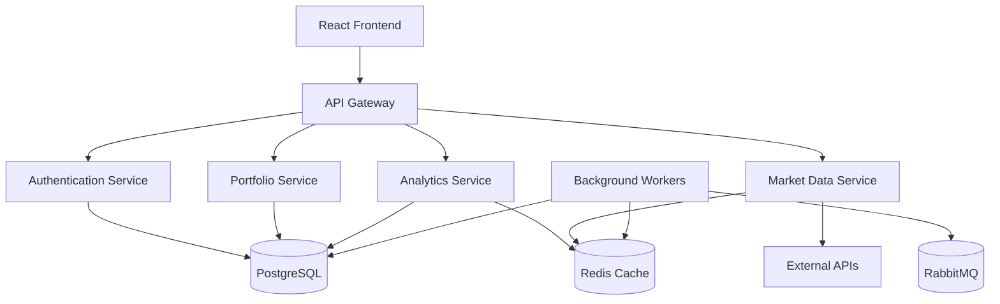
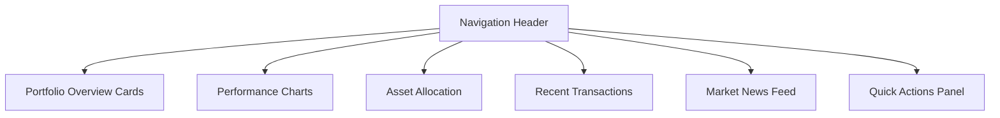
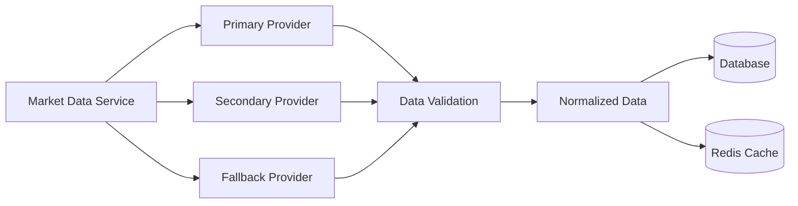
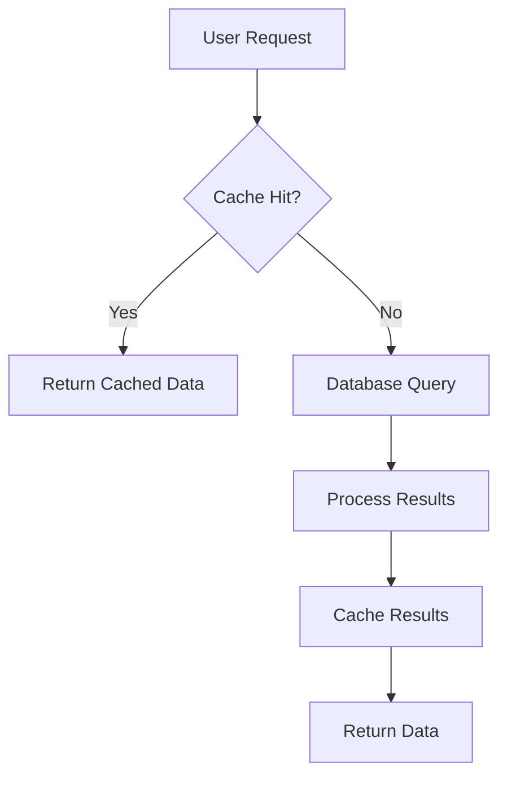
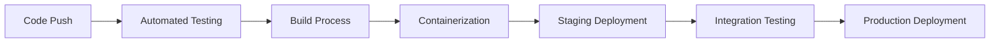

# Stock Portfolio Dashboard Visualizer and Stock Analyzer Application

## Executive Summary

This document outlines the comprehensive requirements and specifications for a modern stock portfolio dashboard visualizer and stock analyzer application. The system builds upon the existing Go-based portfolio management foundation, extending it with advanced analytics, real-time data integration, sophisticated visualizations, and enterprise-grade features.

## Architecture Overview

### Technology Stack
- **Backend**: Go 1.24.5 with Echo web framework
- **Database**: PostgreSQL with pgx driver
- **Authentication**: JWT with refresh tokens
- **Configuration**: Koanf with YAML support
- **Logging**: Zerolog for structured logging
- **Frontend**: React.js with TypeScript (to be implemented)
- **Real-time**: WebSocket integration for live updates
- **Caching**: Redis for performance optimization
- **Message Queue**: RabbitMQ for background processing

### System Architecture



## 1. Core Functionalities

### 1.1 Authentication & User Management

#### Implemented Features
- JWT-based authentication with refresh tokens
- User registration, login, logout endpoints
- User profile management

#### Enhanced Features
- **Multi-Factor Authentication (MFA)**
  - TOTP (Time-based One-Time Password) implementation
  - SMS-based verification via Twilio
  - Backup codes for account recovery
  - Hardware security key support (WebAuthn)

- **OAuth Integration**
  - Google OAuth 2.0
  - Apple Sign-In
  - GitHub OAuth (for developer accounts)
  - Social login with profile data synchronization

- **Advanced User Management**
  - User roles and permissions (Admin, Premium, Basic)
  - Account verification via email
  - Password strength validation and history
  - Session management and concurrent login limits
  - Account deactivation/reactivation workflows

### 1.2 Portfolio Management

#### Current Implementation
- Basic portfolio CRUD operations
- Stock holdings with quantity and purchase price
- Portfolio-level aggregation

#### Enhanced Features
- **Multi-Asset Support**
  - Stocks, ETFs, Mutual Funds, Bonds
  - Cryptocurrencies with wallet integration
  - Real estate and custom asset classes
  - Options and derivatives tracking
  - Forex and commodity holdings

- **Advanced Portfolio Operations**
  - Portfolio cloning and templating
  - Bulk import/export functionality (CSV, Excel)
  - Portfolio comparison and benchmarking
  - Tax lot tracking for capital gains optimization
  - Dividend reinvestment tracking (DRIP)

- **Real-Time Valuation**
  - Live portfolio value calculation
  - Automatic price updates every 15 seconds during market hours
  - Currency conversion for international portfolios
  - Unrealized gains/losses calculation
  - Portfolio performance attribution

### 1.3 Transaction Management

#### Enhanced Transaction Features
- **Comprehensive Transaction Types**
  - Buy, Sell, Short, Cover
  - Dividends and interest payments
  - Stock splits and mergers
  - Fees, commissions, and taxes
  - Transfers between accounts
  - Corporate actions (spinoffs, rights offerings)

- **Advanced Transaction Processing**
  - Automatic transaction categorization
  - Bulk transaction import with validation
  - Transaction reconciliation with broker statements
  - Cost basis calculation methods (FIFO, LIFO, Average Cost)
  - Tax implications tracking

- **Audit and Compliance**
  - Complete transaction history with timestamps
  - Regulatory reporting support (Form 1099, etc.)
  - Transaction amendment and correction workflows

## 2. User Interface Design

### 2.1 Dashboard Layout

#### Main Dashboard Components


#### Key Dashboard Features
- **Responsive Grid Layout**
  - Mobile-first design with progressive enhancement
  - Customizable widget arrangement
  - Dark/light theme support with system preference detection
  - High contrast mode for accessibility

- **Portfolio Overview Cards**
  - Total portfolio value with daily change
  - Today's gain/loss with percentage
  - Largest holdings with performance indicators
  - Sector allocation summary
  - Risk metrics overview

### 2.2 Advanced Visualizations

#### Chart Types and Libraries
- **Primary Chart Library**: Chart.js with react-chartjs-2
- **Advanced Visualizations**: D3.js for custom charts
- **Real-time Charts**: TradingView lightweight-charts for price feeds

#### Visualization Components
- **Portfolio Performance Charts**
  - Line charts for value over time (1D, 1W, 1M, 3M, 6M, 1Y, 5Y, All)
  - Mountain charts for cumulative returns
  - Candlestick charts for individual stock analysis
  - Heat maps for sector performance

- **Asset Allocation Visualizations**
  - Pie charts for current allocation
  - Tree maps for hierarchical breakdown
  - Donut charts for target vs actual allocation
  - Sankey diagrams for cash flow visualization

- **Risk and Analytics Charts**
  - Scatter plots for risk-return analysis
  - Histogram for return distribution
  - Correlation matrix heatmaps
  - Efficient frontier visualization

### 2.3 Individual Stock Analysis Interface

#### Stock Detail Page Components
- **Price Chart Section**
  - Interactive price chart with technical indicators
  - Volume bars and moving averages
  - Drawing tools (trend lines, Fibonacci, support/resistance)
  - Multiple timeframes with synchronized cursors

- **Fundamental Data Panel**
  - Key metrics (P/E, P/B, ROE, Debt/Equity)
  - Financial statements (Income, Balance Sheet, Cash Flow)
  - Analyst ratings and price targets
  - Institutional ownership and insider trading

- **Technical Analysis Tools**
  - 50+ technical indicators (RSI, MACD, Bollinger Bands, etc.)
  - Custom indicator builder
  - Pattern recognition (head & shoulders, double top/bottom)
  - Backtesting capabilities

## 3. Data Integration and Sources

### 3.1 Market Data Providers

#### Primary Data Sources
- **Yahoo Finance API** - Free tier for basic quotes and historical data
- **Alpha Vantage** - Comprehensive fundamental and technical data
- **IEX Cloud** - Real-time and historical price data
- **Polygon.io** - High-frequency trading data and options
- **CoinGecko** - Cryptocurrency data and market information

#### Data Collection Strategy


#### Data Quality and Reliability
- **Data Validation Pipeline**
  - Schema validation for all incoming data
  - Cross-provider data reconciliation
  - Outlier detection and correction
  - Data freshness monitoring and alerts

- **Caching Strategy**
  - Redis for high-frequency data (15-second updates)
  - Database for historical data with time-based partitioning
  - CDN for static market data (company info, logos)

### 3.2 Real-Time Data Streaming

#### WebSocket Implementation
- **Connection Management**
  - Automatic reconnection with exponential backoff
  - Connection pooling for multiple data sources
  - Heartbeat monitoring and health checks

- **Data Streaming Features**
  - Live price updates during market hours
  - Order book data for advanced users
  - News alerts and breaking news notifications
  - Portfolio value real-time recalculation

## 4. Analytics and Visualization Tools

### 4.1 Portfolio Analytics

#### Risk Metrics
- **Standard Risk Measures**
  - Volatility (standard deviation of returns)
  - Beta (market sensitivity)
  - Sharpe Ratio (risk-adjusted returns)
  - Maximum Drawdown
  - Value at Risk (VaR) calculations

- **Advanced Risk Analytics**
  - Conditional Value at Risk (CVaR)
  - Monte Carlo simulations for portfolio stress testing
  - Scenario analysis (recession, bull market, etc.)
  - Black-Litterman model for portfolio optimization

#### Performance Attribution
- **Return Decomposition**
  - Asset allocation contribution
  - Security selection contribution
  - Interaction effects
  - Currency impact for international portfolios

- **Benchmark Comparison**
  - S&P 500, NASDAQ, Russell indices
  - Sector-specific benchmarks
  - Custom benchmark creation
  - Rolling performance windows

### 4.2 Predictive Analytics

#### Machine Learning Integration
- **Price Prediction Models**
  - LSTM neural networks for time series forecasting
  - Random Forest models for feature importance
  - Support Vector Machines for pattern recognition

- **Portfolio Optimization**
  - Mean-variance optimization
  - Risk parity allocation
  - Factor-based investing models
  - Reinforcement learning for dynamic rebalancing

## 5. Security and Compliance Measures

### 5.1 Data Security

#### Encryption and Data Protection
- **Data at Rest**
  - AES-256 encryption for sensitive user data
  - Transparent Data Encryption (TDE) for database
  - Encrypted backups with key rotation

- **Data in Transit**
  - TLS 1.3 for all communications
  - Certificate pinning for mobile applications
  - Perfect Forward Secrecy implementation

#### Access Control
- **Role-Based Access Control (RBAC)**
  - Granular permissions for different user types
  - Resource-level access control
  - Time-based access restrictions
  - Geographic restrictions for compliance

### 5.2 Regulatory Compliance

#### Financial Regulations
- **KYC (Know Your Customer)**
  - Identity verification workflows
  - AML (Anti-Money Laundering) checks
  - Sanction screening integration

- **Data Privacy**
  - GDPR compliance for European users
  - CCPA compliance for California residents
  - Data retention policies and automated deletion

- **Financial Reporting**
  - SEC Form 13F integration for institutional investors
  - Tax document generation (1099 forms)
  - Regulatory filing automation

## 6. Performance Optimization

### 6.1 Backend Performance

#### Database Optimization
- **Query Optimization**
  - Strategic indexing on frequently queried columns
  - Query result caching with Redis
  - Read replicas for reporting queries
  - Connection pooling with pgx

- **Background Processing**
  - Asynchronous price updates using worker queues
  - Batch processing for bulk operations
  - Scheduled jobs for maintenance tasks
  - Dead letter queues for failed operations

#### Caching Strategy


#### Cache Layers
- **L1 Cache**: Application-level (in-memory)
- **L2 Cache**: Redis for distributed caching
- **L3 Cache**: CDN for static assets

### 6.2 Frontend Performance

#### Optimization Techniques
- **Code Splitting**
  - Route-based code splitting with React.lazy
  - Dynamic imports for heavy components
  - Bundle analysis and optimization

- **Asset Optimization**
  - Image optimization and WebP format
  - Font subsetting and optimization
  - CSS and JavaScript minification
  - Critical CSS inlining

#### Real-Time Performance
- **Virtual Scrolling**
  - For large transaction lists
  - For extensive historical data tables
  - Infinite scroll with data virtualization

- **Progressive Loading**
  - Skeleton screens during loading
  - Progressive image loading
  - Lazy loading for below-the-fold content

## 7. User Experience Enhancements

### 7.1 Personalization

#### User Preferences
- **Dashboard Customization**
  - Draggable widget system
  - Customizable color schemes
  - Personalized watchlists and alerts
  - Preferred currency and timezone settings

- **Content Personalization**
  - AI-powered news recommendations
  - Relevant research and analysis
  - Personalized investment insights
  - Custom risk tolerance assessments

### 7.2 Accessibility

#### WCAG 2.1 Compliance
- **Screen Reader Support**
  - ARIA labels and descriptions
  - Semantic HTML structure
  - Keyboard navigation support
  - Focus management

- **Visual Accessibility**
  - High contrast mode
  - Adjustable font sizes
  - Color blindness friendly palettes
  - Motion sensitivity controls

### 7.3 Mobile Experience

#### Progressive Web App (PWA)
- **Offline Capabilities**
  - Service worker for caching
  - Offline portfolio viewing
  - Queue actions for when connection returns

- **Mobile Optimizations**
  - Touch-friendly interface elements
  - Swipe gestures for navigation
  - Pull-to-refresh functionality
  - Native mobile app integration

## 8. Implementation, Deployment, and Scalability

### 8.1 Development Workflow

#### CI/CD Pipeline


#### Development Tools
- **Version Control**: Git with GitHub Actions
- **Containerization**: Docker with multi-stage builds
- **Orchestration**: Kubernetes for production deployment
- **Infrastructure as Code**: Terraform for cloud resources

### 8.2 Scalability Considerations

#### Horizontal Scaling
- **Microservices Architecture**
  - Separate services for authentication, portfolio, analytics
  - API gateway for request routing
  - Service mesh for inter-service communication

- **Database Scaling**
  - Read replicas for query offloading
  - Sharding strategy for large user bases
  - Database connection pooling
  - Query optimization and indexing

#### Cloud Infrastructure
- **AWS/Azure/GCP Multi-Region Deployment**
  - Auto-scaling groups for variable load
  - CDN for global content distribution
  - Multi-region database replication
  - Disaster recovery planning

### 8.3 Monitoring and Observability

#### Application Monitoring
- **Metrics Collection**
  - Application performance monitoring (APM)
  - Custom business metrics (user engagement, feature usage)
  - Infrastructure monitoring (CPU, memory, disk usage)

- **Logging and Alerting**
  - Structured logging with correlation IDs
  - Log aggregation and analysis
  - Real-time alerting for critical issues
  - Error tracking and debugging tools

#### Business Intelligence
- **User Analytics**
  - User journey tracking and funnel analysis
  - Feature usage and adoption metrics
  - Performance attribution and A/B testing

## 9. API Design and Documentation

### 9.1 RESTful API Design

#### API Versioning Strategy
- **Version Header**: Accept-Version header for backward compatibility
- **URL Versioning**: /api/v1/, /api/v2/ for major versions
- **Deprecation Policy**: 12-month deprecation timeline with warnings

#### Standard Response Format
```json
{
  "data": {},
  "meta": {
    "pagination": {},
    "timestamp": "2024-01-01T12:00:00Z"
  },
  "errors": []
}
```

### 9.2 API Documentation

#### OpenAPI Specification
- **Complete API Documentation**: Swagger/OpenAPI 3.0 specification
- **Interactive Documentation**: Swagger UI for testing
- **SDK Generation**: Automatic client SDK generation for multiple languages

#### Developer Portal
- **Authentication**: API key management
- **Rate Limiting**: Tiered rate limits with usage tracking
- **Webhooks**: Event-driven integrations
- **Sandbox Environment**: Testing environment with mock data

## 10. Future Roadmap and Extensions

### 10.1 Advanced Features
- **AI-Powered Insights**
  - Machine learning for investment recommendations
  - Automated portfolio rebalancing
  - Sentiment analysis from news and social media

- **Social Features**
  - Portfolio sharing with privacy controls
  - Investment clubs and communities
  - Peer comparison and benchmarking

### 10.2 Integration Opportunities
- **Broker Integrations**
  - Direct broker API connections
  - Automated trade execution
  - Real-time position synchronization

- **Financial Planning Tools**
  - Retirement planning calculators
  - Tax optimization strategies
  - Goal-based investing frameworks

## 11. Risk Assessment and Mitigation

### 11.1 Technical Risks
- **Market Data Reliability**: Multiple data providers and circuit breakers
- **System Availability**: 99.9% uptime SLA with redundancy
- **Data Security**: Regular security audits and penetration testing
- **Performance Degradation**: Auto-scaling and performance monitoring

### 11.2 Business Risks
- **Regulatory Changes**: Compliance monitoring and rapid adaptation
- **Market Volatility**: System stress testing and capacity planning
- **Data Privacy**: Privacy-by-design principles and user consent management

## Conclusion

This comprehensive specification provides a roadmap for building a world-class stock portfolio dashboard and analyzer application. The system combines robust backend architecture with sophisticated frontend visualizations, advanced analytics, and enterprise-grade security and compliance features.

The modular architecture ensures scalability, while the comprehensive feature set addresses the needs of both individual investors and institutional users. Implementation should follow agile development principles with regular iterations and user feedback integration.

Key success factors include:
- Reliable real-time market data integration
- Intuitive and responsive user interface
- Comprehensive security and compliance measures
- Scalable and maintainable architecture
- Performance optimization for large datasets
- Extensive API and integration capabilities

The system is designed to evolve with market needs and technological advancements while maintaining backward compatibility and user trust.